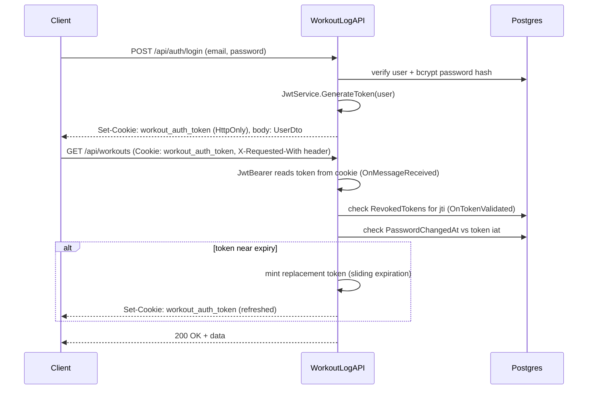

# Backend architecture

This document describes how the ASP.NET Core Web API
(`backend/WorkoutLogAPI/WorkoutLogAPI`) is put together: project layout,
request pipeline, layering conventions, and authentication/security design.
For the database schema itself, see [`database-design.md`](database-design.md).
For a per-endpoint reference, see [`api-reference.md`](api-reference.md).

## Stack

- **.NET 10** / ASP.NET Core Web API.
- **EF Core 10** with **Npgsql** for Postgres access.
- **JWT bearer authentication**, with the token carried in an `HttpOnly`
  cookie rather than a header (see [Authentication](#authentication) below).
- **BCrypt.Net** for password hashing.
- **MailKit** (SMTP) or the **Brevo** transactional email REST API for
  outbound email, selected via configuration.
- **Scalar** (`Scalar.AspNetCore`) serves interactive API docs from the
  OpenAPI document in Development, at `/scalar` — no separate build step
  needed to browse it locally.

## Project layout

```
WorkoutLogAPI/
├── Controllers/     # HTTP endpoints; thin, no direct DB access
├── Services/        # Business logic; talk to WorkoutDbContext directly
├── DTOs/            # Request/response records, one subfolder per feature area
├── Models/          # EF Core entities (see database-design.md)
├── Data/            # WorkoutDbContext + seed data
├── Migrations/      # EF Core migrations
├── Validation/      # Custom [ValidationAttribute]s (weight/reps/RPE ranges)
├── Constants/       # Shared string/config constants (AppConstants)
├── Enums/           # Shared enums (e.g. WeightUnit)
├── Extensions/      # Small static helper extension methods
└── Program.cs       # Composition root: DI, middleware pipeline, auth config
```

### Layering: Controller → Service → DbContext

- **Controllers** (`Controllers/`) handle HTTP concerns only: reading the
  authenticated user ID off the JWT claims (`ControllerExtensions.GetUserId`),
  mapping entities to DTOs, translating exceptions to status codes, and
  logging. They never query `WorkoutDbContext` directly.
- **Services** (`Services/`) hold all business logic and are the only layer
  that talks to `WorkoutDbContext`. They're registered as scoped DI services
  and take the DbContext (and other services) via constructor injection.
  They **throw exceptions** rather than returning result objects/error
  codes — `KeyNotFoundException` for "not found", `InvalidOperationException`
  for business-rule violations (duplicate workout, locked account, etc.),
  `UnauthorizedAccessException` for ownership violations. Controllers catch
  these specific types and map each to the appropriate HTTP status.
- **DTOs** (`DTOs/`) are C# `record`s, one subfolder per feature area
  (`Auth`, `Users`, `Exercises`, `Workouts`, `Admin`, `Email`). Each response
  DTO exposes a static `FromX(entity)` factory method that maps from the EF
  entity, keeping mapping logic co-located with the DTO rather than
  scattered across services/controllers. Request validation is declarative,
  using `System.ComponentModel.DataAnnotations` attributes on the record's
  primary constructor parameters (`[param: Required]`, `[param:
  StringLength]`, etc.), plus a few custom attributes in `Validation/` for
  domain-specific numeric ranges (`WeightRangeAttribute`, `RepsRangeAttribute`,
  `RpeRangeAttribute`) that mirror the same constraints enforced in the
  frontend UI.

This keeps controllers small and consistent; every action follows the same
shape: get the user ID from claims → call one service method → map to a
DTO → return, wrapped in a try/catch that turns known exceptions into
4xx responses and anything else into a logged `500`.

## Request pipeline (`Program.cs`)

Middleware/config is registered in this order:

1. **DbContext, services, JWT auth, authorization policies, CORS** are
   registered with the DI container (see [Authentication](#authentication)).
2. **OpenAPI + Scalar** are mapped only `if (app.Environment.IsDevelopment())`.
3. **`app.SeedDatabaseAsync()`** runs migrations (`Database.MigrateAsync()`)
   and idempotently seeds test users/stock exercises on every startup,
   including in integration tests (see
   [`DatabaseExtensions`](../backend/WorkoutLogAPI/WorkoutLogAPI/Extensions/DatabaseExtensions.cs)).
4. **No `UseHttpsRedirection()`** — Render terminates TLS at the edge and
   forwards plain HTTP, so redirecting to HTTPS inside the app would create
   an infinite redirect loop.
5. **CORS** (`AllowFrontend` policy) — restricts to configured origins,
   allows credentials (cookies).
6. **CSRF middleware** (inline `app.Use(...)`) — rejects any non-GET/HEAD/
   OPTIONS request that's missing the `X-Requested-With` header. See
   [CSRF protection](#csrf-protection).
7. **`UseAuthentication()` / `UseAuthorization()`**.
8. **`/health-check`** — a Minimal API endpoint mapped outside
   `MapControllers()` and before auth, so Render's health checks can hit it
   without a token. Confirms real DB connectivity via `CanConnectAsync()`.
9. **`MapControllers()`**.

## Authentication

Auth is JWT-based, but the token is delivered to the browser as an
**`HttpOnly` cookie** (`workout_auth_token`), not read from
`localStorage`/a header by the frontend. This keeps the token inaccessible
to JavaScript (mitigating XSS token theft) while still using standard JWT
bearer validation on the backend.



Key pieces, all in
[`JwtService`](../backend/WorkoutLogAPI/WorkoutLogAPI/Services/JwtService.cs)
and the `AddJwtBearer` configuration in `Program.cs`:

- **Token extraction from cookie:** `OnMessageReceived` only falls back to
  the cookie if no `Authorization` header is present, so manual testing
  with a bearer header (e.g. via the `.http` file or Scalar) still works.
- **Claims:** `sub` (user ID), `email`, `given_name`, `family_name`,
  `preferred_username` (display name), a custom `is_admin` claim, `jti`
  (unique token ID, used for revocation), and `iat` (issued-at, used to
  invalidate tokens issued before a password change). `MapInboundClaims =
  false` keeps these as their short JWT names instead of ASP.NET's default
  long `ClaimTypes` URIs.
- **Revocation (`revoked_tokens` table):** logging out records the token's
  `jti` as revoked; `OnTokenValidated` rejects any token whose `jti` is in
  that table, even if it hasn't naturally expired.
- **Password-change invalidation:** `OnTokenValidated` also rejects tokens
  issued before `User.PasswordChangedAt`, so resetting a password
  immediately invalidates any tokens issued beforehand.
- **Sliding expiration:** if a valid token has less than
  `Jwt:RefreshThresholdInMinutes` left, `OnTokenValidated` transparently
  mints and re-sets a fresh-cookie token so an active user is never logged
  out mid-session; there is currently no separate `/refresh` endpoint.
- **Account lockout:** `AuthService` locks an account (`IsLocked = true`)
  after 5 consecutive failed login attempts; a locked account must reset
  its password to log in again.
- **Admin authorization:** a `"AdminOnly"` policy
  (`RequireClaim("is_admin", "true")`) protects `AdminController`.

### CSRF protection

Because the auth token lives in a cookie the browser sends automatically,
the API needs separate CSRF protection (a plain cookie alone doesn't prove
the request came from the app's own frontend). `Program.cs` adds inline
middleware that rejects any state-changing request (not GET/HEAD/OPTIONS)
that doesn't include an `X-Requested-With` header. Simple `<form>`
submissions and cross-origin `fetch`/XHR can't set custom headers without
triggering CORS, so this blocks naive cross-site request forgery without
needing a separate CSRF-token handshake. The frontend sets this header on
every mutating request it makes.

### Cookie settings

`JwtService.BuildAuthCookieOptions()` centralizes the cookie flags used
everywhere the token is issued (login, register, sliding refresh):
`HttpOnly = true`, `SameSite = Lax`, `Secure` in all environments except
Development. `SameSite=Lax` (rather than `None`) works because, in
staging/production, the Vercel-hosted frontend proxies `/api/*` to this
backend via `next.config.ts` rewrites, so the browser always sees the
cookie as first-party — avoiding Safari/WebKit's blocking of third-party
`SameSite=None` cookies.

## Other notable design points

- **Enums over the wire:** `WeightUnit` (and other enums) serialize as
  camelCase strings in JSON (`JsonStringEnumConverter` configured in
  `Program.cs`), not integers, so API payloads stay human-readable.
- **Nullable `UserId` = "system" vs. "custom":** `ExerciseController` and
  `ExerciseService` treat `Exercise.UserId == null` as a globally-visible
  system exercise and any other value as a user's private custom exercise;
  every exercise query filters `e.UserId == userId || e.UserId == null`.
- **Ownership checks live in services:** e.g.
  `WorkoutService.GetWorkoutById` throws `UnauthorizedAccessException` if
  the workout's `UserId` doesn't match the caller, keeping the "does this
  resource belong to this user" check next to the query itself rather than
  duplicated in the controller.
- **Whole-tree updates:** `PUT /api/workouts/{id}` takes the entire
  `WorkoutDto` tree (workout + exercises + sets) rather than patching
  individual fields or exposing separate endpoints per nested resource.
  `WorkoutService.UpdateWorkout` reconciles the payload against the
  existing entity graph (`SyncExercises`), soft-deleting anything missing
  from it. There's no partial-update (`PATCH`) support yet — adding it
  would mean either a `JsonPatch` document or an explicit "diff" DTO, plus
  more granular ownership/validation checks per nested field.
- **`AdminController`** is gated both by the `AdminOnly` authorization
  policy and by an `AdminEndpoints:HardDeleteTestWorkoutsEnabled`
  configuration flag (disabled in production), since its one endpoint hard
  -deletes data and exists solely to clean up Playwright E2E test runs.
- **Composition root:** `Program.cs` uses top-level statements but exposes a
  `public partial class Program` at the bottom so
  `WebApplicationFactory<Program>` can boot a real in-process instance of
  the app for integration tests (see `WorkoutLogAPI.Tests/Integration`).
