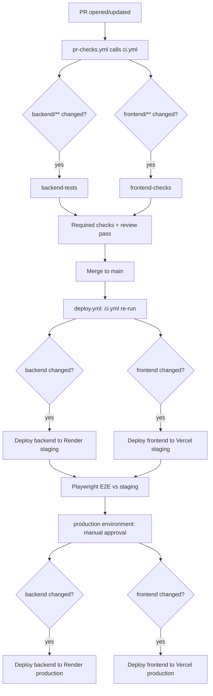

# CI/CD pipeline

This document explains how `workout-log-app` gets tested and deployed via
GitHub Actions. Workflow files live in [`../.github/workflows`](../.github/workflows)
and [`../.github/actions`](../.github/actions).

## Overview

## Workflow files

| File | Trigger | Purpose |
| --- | --- | --- |
| [`ci.yml`](../.github/workflows/ci.yml) | `workflow_call` (reusable) | Detects which side(s) of the app changed and runs the relevant checks. |
| [`pr-checks.yml`](../.github/workflows/pr-checks.yml) | `pull_request` (any branch) | Calls `ci.yml` for every PR. |
| [`deploy.yml`](../.github/workflows/deploy.yml) | `push` to `main` | Re-runs `ci.yml`, then deploys to staging, runs E2E tests, then deploys to production behind manual approval. |

### `ci.yml`

Two jobs, each gated by [`dorny/paths-filter`](https://github.com/dorny/paths-filter)
output from a `changes` job:

- **`backend-tests`** (runs if `backend/**` changed): `dotnet build` +
  `dotnet test` against `WorkoutLogAPI.sln`. Integration tests spin up their
  own Postgres via Testcontainers - no external database or secrets needed.
  Results print straight to the job log (no artifact - xUnit's console
  output already includes full failure text/stack traces).
- **`frontend-checks`** (runs if `frontend/**` changed): `npm run lint` +
  `npm run build` in `frontend/`. No environment variables are required at
  build time (no `getStaticProps`/`getServerSideProps` hit the network, and
  `NEXT_PUBLIC_API_URL` has a safe fallback).

`ci.yml` exposes `backend_changed`/`frontend_changed` as workflow outputs so
`deploy.yml` can reuse the same change detection instead of duplicating it.

### Path-based job skipping

The workflow *triggers* unconditionally are (any PR, every push to `main`) -
only individual **jobs** are conditionally skipped via
`if: needs.changes.outputs.backend == 'true'`. This distinction matters:

- If the trigger itself were restricted with `paths:`/`paths-ignore:` at the
  workflow level, a docs-only PR would never run the workflow at all, and
  GitHub would show the required status checks as permanently "Expected -
  Waiting for status to be reported" - blocking the merge forever.
- Instead, the workflow always runs, but a job that's *skipped* (not simply
  absent) is treated as **passing** for branch protection purposes. A
  docs-only change safely skips both `backend-tests` and `frontend-checks`
  without blocking the merge.

The same logic gates the deploy jobs in `deploy.yml`: a docs-only merge to
`main` still runs the `ci` job, but every deploy job is skipped since neither
`backend_changed` nor `frontend_changed` is `true`.

### `pr-checks.yml`

Thin wrapper that calls `ci.yml` on every pull request. Also accepts
`workflow_dispatch` (**Actions tab → PR Checks → Run workflow**, pick a
branch), so checks can be re-run manually without pushing a new commit -
e.g. after fixing an unrelated CI config issue. Note that this reruns
`ci.yml` fresh, so its path-based job skipping still applies: dispatching
against a branch with no backend/frontend diff against its base will skip
both `backend-tests` and `frontend-checks` just like a normal PR run would.

Configure branch protection on `main` to require:

- Status checks **`ci / backend-tests`** and **`ci / frontend-checks`**
- An approving review.

### `deploy.yml`

Runs on every push to `main` (i.e. every merged PR):

1. **`ci`** - re-runs the same checks from `ci.yml` against the merge
   commit.
2. **`deploy-staging-backend`** / **`deploy-staging-frontend`** - deploy
   whichever side(s) changed to the staging Render service / Vercel
   project, gated by `environment: staging`.
3. **`e2e-staging`** - runs once both staging deploys have either succeeded
   or been skipped, and only if backend or frontend actually changed (a
   docs-only merge, where both deploy jobs are skipped, does *not* trigger
   an E2E run against an unchanged staging environment). Runs the full
   Playwright suite (`playwright-tests/`) against the staging URLs with
   `--reporter=line` for console pass/fail output; the HTML report (with
   failure traces/screenshots) is only uploaded as an artifact
   `if: failure()`, since that's the only place trace data exists - console
   text alone doesn't capture it.
4. **`deploy-production-backend`** / **`deploy-production-frontend`** -
   gated by `environment: production`. A required reviewer is configured so 
   these jobs pause for manual approval after `e2e-staging`
   succeeds.

## Composite actions

Both staging and production deploy jobs share the same deploy logic via two
composite actions instead of duplicating steps:

- [`render-deploy`](../.github/actions/render-deploy/action.yml): triggers a
  Render deploy pinned to a specific commit SHA (`commitId`), polls until
  its status is `live`, then polls a health-check URL until it responds
  (the free-tier staging environment may take up to a minute to spin up).
- [`vercel-deploy`](../.github/actions/vercel-deploy/action.yml): runs
  `vercel pull --environment=production` + `vercel build --prod` +
  `vercel deploy --prebuilt --prod` against a given Vercel project.

Because staging and production are **separate** Render services and
**separate** Vercel projects (a free-tier constraint), there's no way to
literally promote one build artifact across projects. Both composite actions
are always invoked with the same `github.sha`, so what gets built and
deployed to production is guaranteed to be the identical source commit that
already passed `e2e-staging` - just rebuilt fresh in each project/service
rather than promoted as one artifact.

## Required secrets and variables

Every value is scoped to a GitHub Environment (`staging` or `production`)

| Environment | Secrets | Variables |
| --- | --- | --- |
| `staging` | `RENDER_API_KEY`, `VERCEL_TOKEN`, `TEST_USER_EMAIL`, `TEST_USER_PASSWORD` | `RENDER_SERVICE_ID`, `VERCEL_ORG_ID`, `VERCEL_PROJECT_ID`, `STAGING_APP_URL`, `STAGING_API_URL` |
| `production` | `RENDER_API_KEY`, `VERCEL_TOKEN` | `RENDER_SERVICE_ID`, `VERCEL_ORG_ID`, `VERCEL_PROJECT_ID`, `PRODUCTION_API_URL` |

`TEST_USER_EMAIL`/`TEST_USER_PASSWORD` are the dedicated Playwright test
account credentials (see [`playwright-tests/README.md`](../playwright-tests/README.md))
and only need to exist in the `staging` environment, since E2E tests only
ever run against staging.
