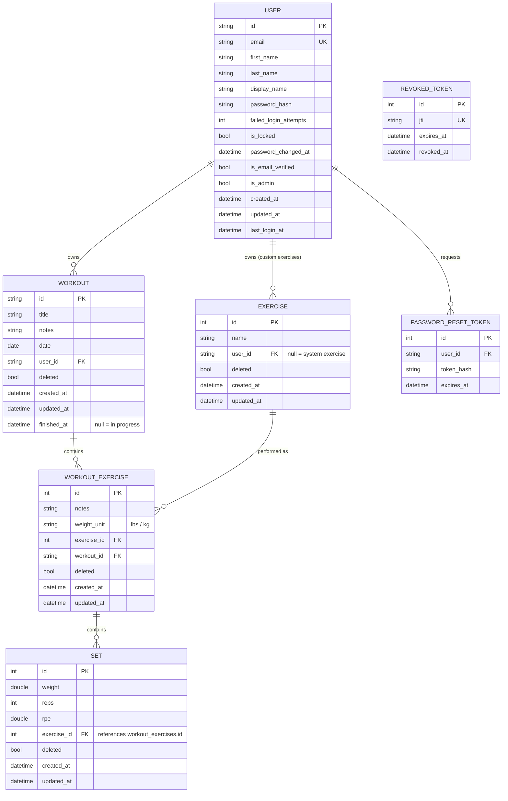

# Database design

This document describes the Postgres schema for `workout-log-app`, how it's
defined, and the reasoning behind the main design decisions. It's generated
from the code-first EF Core model in
[`backend/WorkoutLogAPI/WorkoutLogAPI/Models`](../backend/WorkoutLogAPI/WorkoutLogAPI/Models)
and
[`backend/WorkoutLogAPI/WorkoutLogAPI/Data/WorkoutDbContext.cs`](../backend/WorkoutLogAPI/WorkoutLogAPI/Data/WorkoutDbContext.cs).

## Overview

- **Engine:** PostgreSQL (Postgres 16 locally via Docker; [Neon](https://neon.tech/)
  serverless Postgres in staging and production).
- **Approach:** Code-first with EF Core. The C# entity classes in `Models/`
  are the source of truth; migrations in `Migrations/` are generated from
  them (`dotnet ef migrations add ...`) and applied automatically on
  startup via `DatabaseExtensions.SeedDatabaseAsync` (`context.Database.MigrateAsync()`).
- **Naming convention:** PascalCase C# properties are mapped explicitly to
  `snake_case` table and column names using `[Table]`/`[Column]` data
  annotations, which is idiomatic Postgres style.
- **IDs:** Most primary keys are `string` GUIDs (`Guid.NewGuid().ToString()`),
  generated in application code rather than by the database. `Exercise`,
  `WorkoutExercise`, and `Set` use plain auto-incrementing `int` identities
  instead, since they don't need to be unguessable/globally unique.
- **Soft deletes:** `Exercise`, `Workout`, `WorkoutExercise`, and `Set` all
  have a `deleted` boolean flag rather than being physically removed from the
  table. Queries throughout the service layer filter with `!Deleted`.
- **Auditing:** Entities that represent user-facing data implement
  `IAuditableEntity` (`CreatedAt` / `UpdatedAt`). `WorkoutDbContext` overrides
  `SaveChanges`/`SaveChangesAsync` to automatically stamp `UpdatedAt` on any
  modified auditable entity.

## Entity-relationship diagram

## Table reference

### `users`

Application accounts. Authentication is handled with a bcrypt password hash
and JWTs (see [`AuthService`](../backend/WorkoutLogAPI/WorkoutLogAPI/Services/AuthService.cs)
and [`JwtService`](../backend/WorkoutLogAPI/WorkoutLogAPI/Services/JwtService.cs)).

- `id` (PK, string GUID)
- `email` (unique index, `AddUserEmailUniqueConstraint` migration)
- `first_name`, `last_name`, `display_name` (optional)
- `password_hash` — bcrypt hash, never the plaintext password
- `failed_login_attempts` / `is_locked` — basic brute-force lockout support
- `password_changed_at`, `is_email_verified`, `is_admin`, `last_login_at`
- `created_at` / `updated_at` — audited via `IAuditableEntity`

### `exercises`

A catalog of exercises (e.g. "Barbell Bench Press"). Can be a **system
exercise** (`user_id` is `null`, seeded in `ExerciseSeedData`, visible to
everyone) or a **custom exercise** created by a specific user.

- `id` (PK, `int` identity)
- `name` (non-unique index for lookups/search)
- `user_id` (FK to `users.id`, nullable, `ON DELETE RESTRICT`)
- `deleted`, `created_at`, `updated_at`
- **Check constraint** `CK_Exercise_SystemExercise_NotDeleted`: `user_id IS
  NOT NULL OR deleted = false`. System exercises (`user_id IS NULL`) can
  never be soft-deleted, so the stock list stays intact for every user.

### `workouts`

A single logged workout session for a user.

- `id` (PK, string GUID)
- `title`, `notes` (optional)
- `date` — a `DateOnly` (Postgres `date`, no time component), since a
  workout is associated with a calendar day rather than a specific instant
  (see the `UseDateOnlyForWorkoutDate` migration)
- `user_id` (FK to `users.id`, `ON DELETE RESTRICT`)
- `deleted`, `created_at`, `updated_at`
- `finished_at` (nullable) — `null` while the workout is in progress; set
  to the current UTC time by `WorkoutService.FinishWorkout` (`PATCH
  /api/workouts/{id}/finish`). A user can have at most one in-progress
  (`finished_at IS NULL`, not deleted) workout at a time —
  `WorkoutService.CreateWorkout` enforces this in application code rather
  than a DB constraint. Powers autosave: the frontend creates a workout
  immediately with top-level fields only, persists exercise/set edits via
  `PUT`, and the `GET /api/workouts/active` endpoint lets the UI resume an
  in-progress workout (e.g. after navigating away and back) by querying for
  `finished_at IS NULL`.

### `workout_exercises`

A join/detail entity: one exercise as it was performed within one workout
(e.g. "Bench Press, set with 135 lbs"). This is where per-workout notes and
the weight unit used for that instance live, separate from the exercise
catalog entry itself.

- `id` (PK, `int` identity)
- `notes` (optional, specific to this workout instance)
- `weight_unit` — the `WeightUnit` enum (`Lbs`/`Kg`), stored as its
  lowercase string name (`"lbs"`/`"kg"`) via an EF value converter so the
  column is human-readable and matches the API's JSON representation,
  rather than the default numeric enum value
- `exercise_id` (FK to `exercises.id`, `ON DELETE RESTRICT`)
- `workout_id` (FK to `workouts.id`, `ON DELETE RESTRICT`)
- `deleted`, `created_at`, `updated_at`

### `sets`

An individual set (weight/reps/RPE) performed for a `workout_exercises` row.
Despite the FK property being named `ExerciseId` in code, it actually points
at `workout_exercises.id`, not `exercises.id` — a set only makes sense in
the context of one specific exercise-within-a-workout.

- `id` (PK, `int` identity)
- `weight` (nullable `double`), `reps` (nullable `int`), `rpe` (nullable
  `double`, Rate of Perceived Exertion, used by the 1RM calculator)
- `exercise_id` (FK to `workout_exercises.id`, `ON DELETE RESTRICT`)
- `deleted`, `created_at`, `updated_at`

### `password_reset_tokens`

Short-lived tokens for the forgot-password flow. Only the hash of the token
is stored, not the raw value emailed to the user.

- `id` (PK, `int` identity)
- `user_id` (FK to `users.id`, indexed, not enforced with a DB-level FK
  constraint navigation in the model)
- `token_hash`
- `expires_at`

### `revoked_tokens`

A denylist of JWT IDs (`jti`) that were explicitly invalidated (e.g. via
logout) before their natural expiry, so `JwtService` can reject an
otherwise still-valid, unexpired token.

- `id` (PK, `int` identity)
- `jti` (unique index)
- `expires_at` — mirrors the token's own expiry, so old rows can eventually
  be pruned
- `revoked_at`

## Design notes

### Why soft deletes?

`Exercise`, `Workout`, `WorkoutExercise`, and `Set` are all soft-deleted
(`deleted` flag) instead of using a hard `DELETE`. This preserves history
(e.g. an exercise removed from a past workout doesn't corrupt that
workout's record) and avoids needing `ON DELETE CASCADE` chains through
workouts → workout_exercises → sets. It's also why every foreign key in the
schema uses `DeleteBehavior.Restrict`: rows are never expected to be hard
deleted by a database-level cascade, only marked `deleted = true` by the
application, so an accidental hard delete of a parent row is blocked
instead of silently cascading.

### Why are exercises separate from workout_exercises?

`exercises` is a catalog (name + owner), while `workout_exercises` captures
the point-in-time details of using that exercise in a specific workout
(notes, weight unit). This lets a user's exercise history be queried across
all workouts (`WorkoutService.GetExerciseHistory`) by joining on
`exercise_id`, while still letting each workout's notes/weight unit vary
independently.

### System vs. custom exercises

A single `exercises` table serves both the global stock list (seeded at
startup by `ExerciseSeedData`, `user_id = null`) and user-created custom
exercises (`user_id = <owner>`). The check constraint enforces that system
rows can never be soft-deleted, protecting the shared seed data from being
hidden by one user's action while still letting users delete their own
custom exercises.

### GUID vs. int primary keys

`users` and `workouts` use string GUIDs generated in application code. This
avoids leaking sequential/guessable IDs for user-facing resources exposed
directly in API routes and URLs. `exercises`, `workout_exercises`, and
`sets` use simple `int` identities since they're nested resources always 
accessed through their parent workout, so enumerability isn't a practical concern.

### Migrations

Notable migrations beyond the initial schema:

- `MergeExerciseTables` — consolidated what were originally separate system
  and custom exercise tables into the single `exercises` table described
  above.
- `AddFinishedAtToWorkouts` — added the `finished_at` column and backfilled
  existing rows with `COALESCE(updated_at, created_at)` so historical
  workouts aren't retroactively treated as in-progress.
