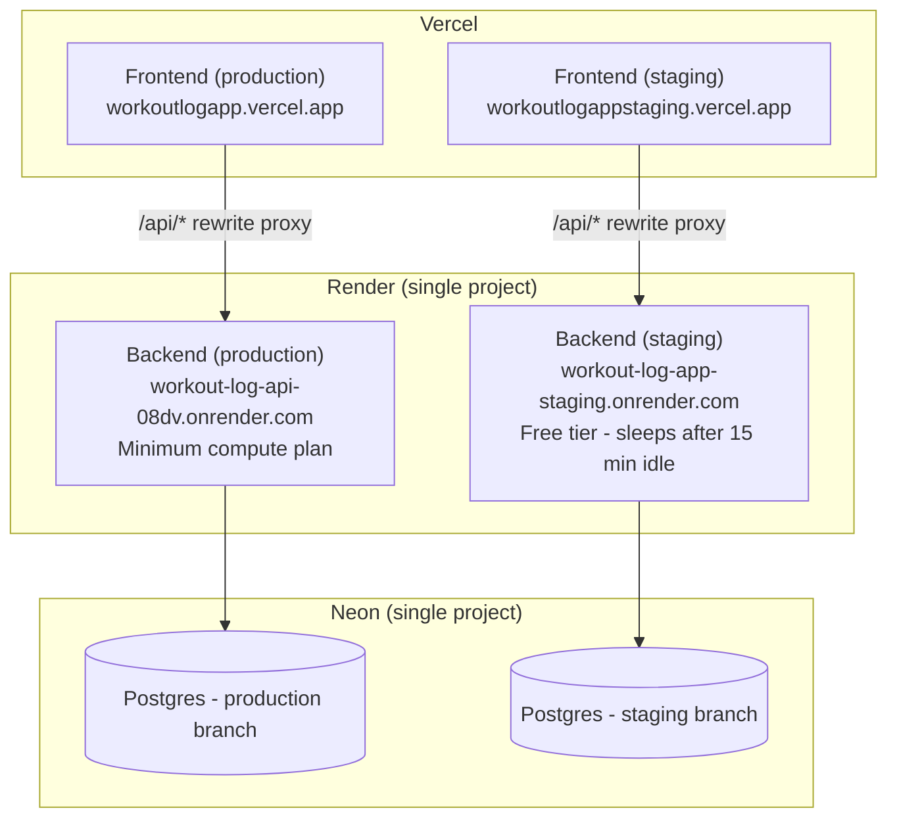

# Infrastructure

This document describes where `workout-log-app` actually runs: hosting
providers, environments, and how the pieces talk to each other in staging
and production. For how code gets from a merged PR to these environments,
see [`ci-cd.md`](ci-cd.md). For how each piece is built internally, see
[`backend-architecture.md`](backend-architecture.md) and
[`frontend-architecture.md`](frontend-architecture.md).

## Overview

Every environment is a full, independent vertical slice: its own frontend
deployment, its own backend deployment, and its own database branch. There's
no shared component between staging and production - a bad staging deploy
or a heavy staging test run can't affect production.

## Environments at a glance

| | Frontend (Vercel) | Backend (Render) | Database (Neon) |
| --- | --- | --- | --- |
| **Production** | [workoutlogapp.vercel.app](https://workoutlogapp.vercel.app) — own Vercel project | [workout-log-api-08dv.onrender.com](https://workout-log-api-08dv.onrender.com) — own Render web service, **minimum compute plan** | `production` branch |
| **Staging** | [workoutlogappstaging.vercel.app](https://workoutlogappstaging.vercel.app) — own Vercel project | [workout-log-app-staging.onrender.com](https://workout-log-app-staging.onrender.com) — own Render web service, **free tier** | `staging` branch |

### Render: one project, two services

Both backend services live under the same Render project, but as **separate
web services** rather than Render's preview-environment feature. This gives
each environment a fixed, predictable URL (`workout-log-api-08dv...` /
`workout-log-app-staging...`) that never changes, which is what CI/CD, the
Vercel rewrite proxy, and Playwright's `STAGING_API_URL`/`PRODUCTION_API_URL`
secrets all target — none of them need to resolve a dynamically-generated
preview URL.

The two services are also on different plans:

- **Production** runs on Render's minimum paid compute plan specifically so
  it never spins down. Render's free tier sleeps a service after 15 minutes
  of inactivity, and a cold start on the next request would mean a real user
  hitting a multi-second delay (or a Playwright/E2E-style timeout) — not
  acceptable for the environment real users hit.
- **Staging** stays on the free tier and *does* sleep after 15 minutes of
  inactivity, since it costs nothing and staging traffic is infrequent
  (CI-triggered deploys + occasional manual checks). The `render-deploy`
  composite action's health-check poll (see [`ci-cd.md`](ci-cd.md#composite-actions))
  already accounts for the cold-start delay this can cause after a deploy.

### Vercel: two projects instead of one with environments

Vercel's free tier doesn't support the kind of persistent,
separately-configured "staging" environment this project needs (distinct
env vars, its own stable production-mode URL), so staging and production are
two entirely separate Vercel **projects**, each deployed to its own
`--prod` target (see the `vercel-deploy` composite action in
[`ci-cd.md`](ci-cd.md#composite-actions)). Each project gets its own
`VERCEL_PROJECT_ID` and env vars in the corresponding GitHub Environment
secrets.

**Why Vercel for the frontend at all**, rather than hosting both frontend
and backend on Render: this app originally was a full-stack Next.js
application (API routes and all) hosted entirely on Vercel. When the
backend was rebuilt as a separate ASP.NET Core API, it moved to Render (a
better fit for a long-running .NET process with a persistent DB
connection), but the Next.js frontend stayed on Vercel rather than also
migrating, since Vercel remains an excellent fit for hosting Next.js
specifically and there was no strong reason to move it.

### Neon: one project, two branches

The Postgres database is a single Neon project with **production** and
**staging** branches rather than two separate projects. Neon's branching
model is built for exactly this — the staging branch can be reset/reseeded
independently without needing separate project-level billing/configuration,
while still living under one place to manage.

## How the pieces connect

- **Frontend → backend:** the browser never calls the Render backend URL
  directly. Each Vercel project's `next.config.ts` rewrites `/api/*` to that
  environment's `BACKEND_API_URL` (a server-side env var — see
  [`frontend-architecture.md`](frontend-architecture.md#data-flow-api-client-layer)),
  so the browser only ever talks to its own Vercel origin. This keeps the
  `HttpOnly` auth cookie first-party even though the frontend and backend
  are on different domains/hosts, which matters for Safari/WebKit's
  cookie-blocking behavior (see
  [`backend-architecture.md`](backend-architecture.md#cookie-settings)).
- **Backend → database:** each Render service's `ConnectionStrings:DefaultConnection`
  points at that environment's Neon branch, set as a Render environment
  variable (not committed — `appsettings.json` ships with an empty
  connection string as a placeholder). EF Core migrations run automatically
  on startup (`app.SeedDatabaseAsync()`), so deploying a new backend version
  to either service also brings that Neon branch's schema up to date.
- **CORS:** the backend's `Cors:AllowedOrigins` is environment-specific
  (e.g. production only allows `https://workoutlogapp.vercel.app`), set the
  same way — as a Render environment variable override of the
  `appsettings.json` default — so one environment's frontend can't
  accidentally call the other environment's backend.
- **Environment-specific feature flags:** a couple of settings intentionally
  differ per environment via the same Render env var mechanism, e.g.
  `AdminEndpoints:HardDeleteTestWorkoutsEnabled` is `true` in staging (so
  the Playwright suite can clean up test data via
  `AdminController`/`hard-delete-test-workouts`) and `false` in production.

## Local development vs. hosted environments

Locally, there's no proxy and no Neon branch involved: the frontend calls
`http://localhost:5258` directly via `NEXT_PUBLIC_API_URL`, and the backend
points at whatever Postgres instance you configure (the `docker-compose.yml`
Postgres 16 container, by default — see the root
[`README.md`](../README.md)). This keeps local setup simple while staging
and production layer on the proxy/CORS/cookie behavior described above.
